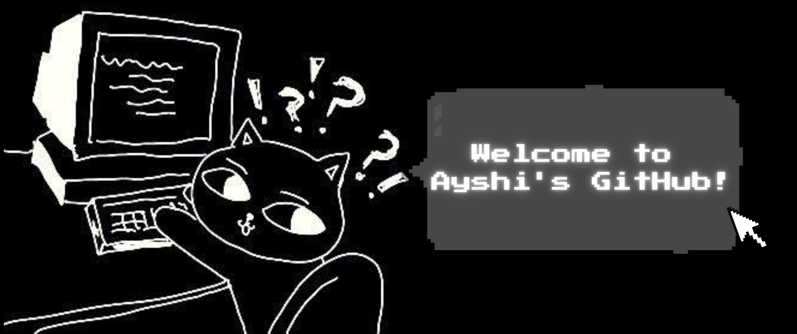

<!-- ═══════════════════════════════════════════════════════════ -->
<!--                      BANNER IMAGE                         -->
<!-- Replace banner.png with your actual image filename        -->

---

# Hi there, I'm Ayshi 👋

🎓 BSc in Computer Science & Engineering — BRAC University  
💻 Web Developer | Frontend Specialist | Next.js · MERN stack . Tailwind CSS  
🌱 Currently learning full-stack web development  
🔬 Background in deep learning and satellite image processing 

---

## 🚀 What I'm Up To

🐾 Currently building and deploying full-stack platforms using Next.js, Express, and MongoDB  
📖 Exploring **Next.js App Router**, server components, and authentication with Better Auth & JWT  
🎨 Diving deeper into UI/UX with theming, responsive design, and learning Figma on the go  
🤖 Interested in exploring **Software Development, LLMs and AI-assisted development** as a future direction  
📝 Keeping a vibe coding journal to document my learning journey

---

## 🛠️ Tech Stack

---

### 🔗 Connect with me

<!--
**IsratAyshi/IsratAyshi** is a ✨ _special_ ✨ repository because its `README.md` (this file) appears on your GitHub profile.

Here are some ideas to get you started:

- 🔭 I’m currently working on ...
- 🌱 I’m currently learning ...
- 👯 I’m looking to collaborate on ...
- 🤔 I’m looking for help with ...
- 💬 Ask me about ...
- 📫 How to reach me: ...
- 😄 Pronouns: ...
- ⚡ Fun fact: ...
-->
